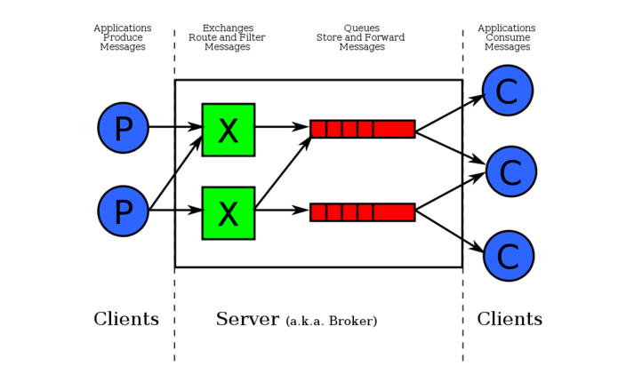
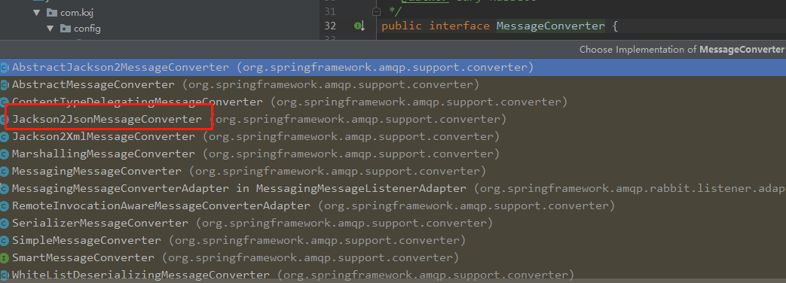

## MQ

### 定义

面向消息的中间件（message-oriented middleware）MOM能够很好的解决以上问题，是指利用高效可靠的消息传递机制与平台无关的数据交流，并基于数据通信来进行分布式系统的集成。
通过提供消息传递和消息排队模型在分布式环境下提供应用解耦，弹性伸缩，冗余存储、流量削峰，异步通信，数据同步等功能。
大致的过程是这样的：
发送者把消息发送给消息服务器，消息服务器将消息存放在若干队列/主题topic中，在合适的时候，消息服务器回将消息转发给接受者。在这个过程中，发送和接收是异步的，也就是发送无需等待，而且发送者和接受者的生命周期也没有必然的关系；
尤其在发布pub/订阅sub模式下，也可以完成一对多的通信，即让一个消息有多个接受者。


### 作用

- 解耦：当新的模块进来时，要做到代码改动最小，能够解耦
- 削峰：设置流量缓冲池，可以让后端系统按照自身吞吐能力进行消费，不被冲垮，能够削峰
- 异步：强弱依赖梳理能够将非关键调用链路的操作异步化并提升整体系统的吞吐能力，能够异步

### 种类

- Kafka
- RabbitMQ
- RocketMQ
- ActiveMQ

### 消息发送和接收机制

所有 MQ 产品从模型抽象上来说都是一样的过程：

消费者(consumer)订阅某个队列。生产者(producer)创建消息，然后发布到队列(queue)中，最后将消息发送到监听的消费者

  

## RabbitMQ

### 结构图



### 执行流程

 

### 相关概念

- Message

消息，消息是不具名的，它由消息头和消息体组成。消息体是不透明的，而消息头则由一系列的可选属性组成，这些属性包括routing-key(路由键)、priority(相对于其他消息的优先权)、delivery-mode(指出该消息可能需要持久性存储)等。

- Publisher

消息的生产者，也是一个向交换器发布消息的客户端应用程序。

- Exchange

交换器，用来接收生产者发送的消息并将这些消息路由给服务器中的队列。

- Binding

绑定，用于消息队列和交换器之间的关联。一个绑定就是基于路由键将交换

器和消息队列连接起来的路由规则，所以可以将交换器理解成一个由绑定构成的路由表。

- Queue

消息队列，用来保存消息直到发送给消费者。它是消息的容器，也是消息的终点。一个消息可投入一个或多个队列。消息一直在队列里面，等待消费者连到这个队列将其取走。

- Connection

网络连接，比如一个TCP连接。

- Channel

信道，多路复用连接中的一条独立的双向数据流通道。信道是建立在真实的TCP连接内地虚拟连接，AMQP 命令都是通过信道发出去的，不管是发布消息、订阅队列还是接收消息，这些动作都是通过信道完成。因为对于操作系统来说建立和销毁 TCP 都是非常昂贵的开销，所以引入了信道的概念，以复用一条 TCP连接。

- Consumer

消息的消费者，表示一个从消息队列中取得消息的客户端应用程序。

- Virtual Host

虚拟主机，表示一批交换器、消息队列和相关对象。虚拟主机是共享相同的

身份认证和加密环境的独立服务器域。每个 vhost 本质上就是一个 mini 版的

RabbitMQ 服务器，拥有自己的队列、交换器、绑定和权限机制。vhost 是 AMQP概念的基础，必须在连接时指定，RabbitMQ 默认的 vhost 是 / 。 


### 分发策略

- direct 

  点对点

- fanout

  广播

- topic

  匹配相对路径

  '#' 匹配一个字符

  '*' 匹配多个字符


### 安装

- 下载镜像

  ```shell
  docker pull rabbitmq:tag
  
  # docker pull rabbitmq (镜像未配有控制台)
  # docker pull rabbitmq:management (镜像配有控制台)
  ```

- 启动容器

  ```shell
  docker run --name rabbitmq -d -p 15672:15672 -p 5672:5672 rabbitmq:management
  # 15672是管理界面的端口
  # 5672 是服务的端口
  # RABBITMQ_DEFAULT_USER=user -e RABBITMQ_DEFAULT_PASS=password 不配置默认登录界面账号密码都是guest
  ```

   

### 自动配置原理

`RabbitAutoConfiguration`

- 自动配置了 连接工厂 `CachingConnectionFactory`
- `RabbitProperties`   封装了所有配置
- `RabbitTemplate` 给RabbitMQ发送和接收消息
-  `AmqpAdmin`  RabbitMQ系统管理功能组件


**序列化**

- 重新定义消息转换器

  

  ```java
  @Configuration
  public class RabbitConfig {
  
      @Bean
      public MessageConverter messageConverter() {
          return new Jackson2JsonMessageConverter();
      }
  
  }
  ```

  


## ActiveMQ

### 安装

```安装
docker search activemq
docker pull webcenter/activemq
docker run -d --name activemq -p 61616:61616 -p 8161:8161 webcenter/activemq:latest
```

